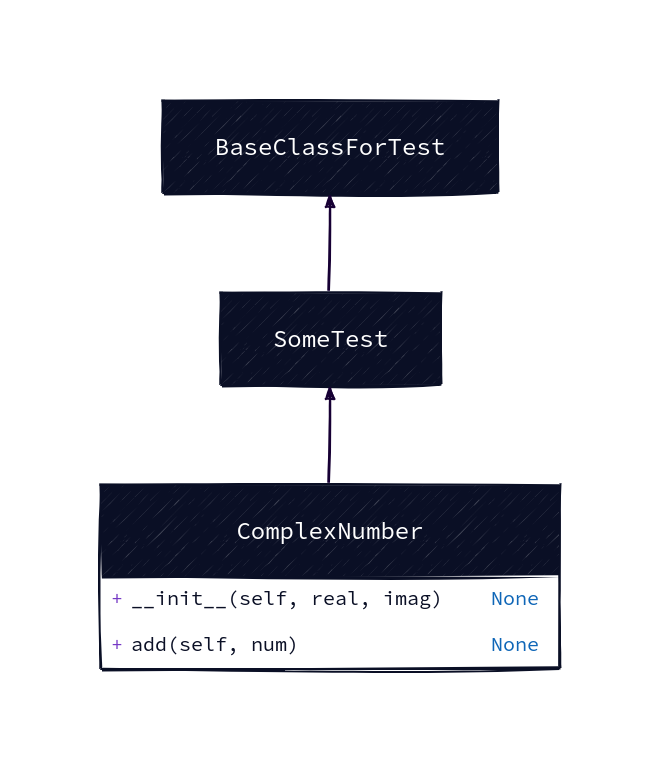
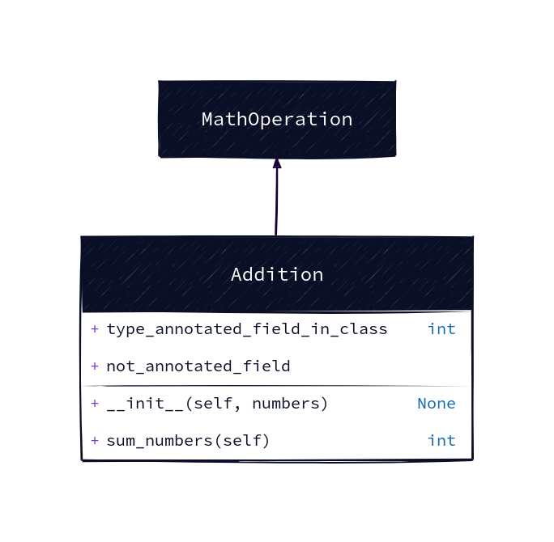

# Specifipy


Python package for auto-generating code diagrams

## What is that? 
Specifipy helps you visually understand your Python code. It generates UML code diagrams 
for your object-oriented programs showing you the inheritance, interfaces, fields, methods and
functions.

## How to use that? 
### Scanning directory and generating diagrams for all files
Import the `specifipy` class you need. If you want to recursively scan the directory (probably 
the most common usecase) just follow these steps:
```python
from specifipy.file_scanners.directory_scanner import DirectoryScanner
d = DirectoryScanner("/path/to/your/src/directory")
d.make_diagrams()
```

This will create all the diagrams for all the files that contain Python classes right in your working dir. You can, of
course, provide the directory in `make_diagrams` to have the output file wherever you wish.

### Using Java?
In such case, you'll need to provide additional arguments.

### In-place diagram generation
If you want to generate diagram in-place, for a single file, you can just load its context into a string and
then provide it directly to the `DiagramGenerator`, like this:
```python
from specifipy.parsers.diagram_generator_d2 import DiagramGenerator

diagram_generator = DiagramGenerator()
diagram_generator.generate_diagram(
    file_contents_str,
    "complex_number_old_python.py",
    base_path=f"./diagrams/",
)
```

Of course, you can provide as `file_contents_str` any valid Python code however you'd like, not only from a file.

### Diagram example
The complete diagram looks something like this
```python
class BaseClassForTest:
    pass


class SomeTest(BaseClassForTest):
    pass


class ComplexNumber(SomeTest):
    """
    This is a class for mathematical operations on complex numbers.

    Attributes:
        real (int): The real part of complex number.
        imag (int): The imaginary part of complex number.
    """

    def __init__(self, real, imag):
        """
        The constructor for ComplexNumber class.

        Parameters:
           @:param real (int): The real part of complex number.
           @:param imag (int): The imaginary part of complex number.
        """
        self.real = real

    def add(self, num):
        """
        The function to add two Complex Numbers.

        Parameters:
            num (ComplexNumber): The complex number to be added.

        Returns:
            ComplexNumber: A complex number which contains the sum.
        """

        re = self.real + num.real
        im = self.imag + num.imag

        return ComplexNumber(re, im)

```


or like this
```python
class MathOperation:
    pass


class Addition(MathOperation):

    type_annotated_field_in_class: int
    not_annotated_field = 0


    def __init__(self, numbers: list[int]):
        self.numbers = numbers

    def sum_numbers(self) -> int:
        running_sum: int = 0
        for number in self.numbers:
            running_sum += number

        return running_sum

```



And here's this exact codebase (including examples above):


---
If you like this project, and it helped you in any way, I'll be thrilled to know that! I like to write software that's 
actually useful.
